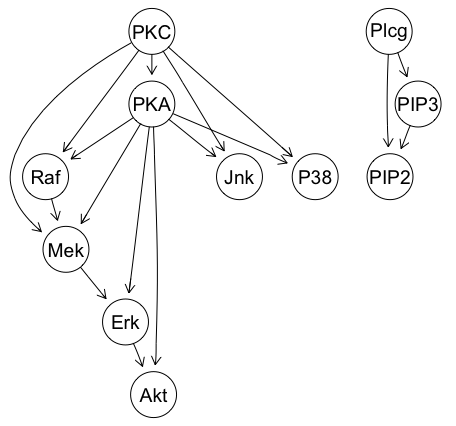

```{r setup, include = FALSE}
knitr::opts_chunk$set(
  collapse = TRUE,
  comment = "#>"
)
```

This document is a vignette in the R package causaldemon, which can be found in [Github](https://github.com/robertness/causal_demon).

```{r, message=FALSE}
library(causaldemon)
library(rstan)
library(tidyverse)
library(ggplot2)
```

The 2005 Nature paper [Causal Protein-Signaling Networks Derived from Multiparameter Single-Cell Data](http://science.sciencemag.org/content/308/5721/523) demonstrated the use of multivariate measurements of protein activity to infer the causal structure of a biochemical network.  Many subsequent causal structure discovery publications have used this as a benchmark dataset.

This analysis demonstrates how to use this causal network and datset to predict the outcome of a future intervention experiment.

# Protein signaling dataset

In this dataset there are simultaneous measurements of 11 proteins:

```{r}
# Load the processed data
data(isachs)
isachs <- as_tibble(isachs)
proteins <- setdiff(names(isachs), 'INT')
proteins
```

The measurements quantify protein signaling activity.  Preprocessed data was sourced from the [datasets page](http://www.bnlearn.com/book-crc/) of the website causal discovery package [bnlearn](http://www.bnlearn.com).  For each protein there is a factor with three levels; 1 (low activity), 2 (medium activity), 3 (high activity).

```{r}
isachs[proteins]
```

For purposes of this model, these are converted to binary variables, values of 1 become 0 (i.e. 'off'), values of 2 or 3 becomes 1 (i.e. 'on').  

```{r}
# Convert to binary factors
for(prot in proteins){
  isachs[[prot]] <- ifelse(isachs[[prot]] == 1, 0, 1)
}
```

The `INT` column of the dataset refers to proteins that were subject to intervention in the experiment.  Here, an intervention means the value of that protein was artificially set to "on" or "off".  The following code generates a table counting the number of interventions for a given protein. 

```{r}
table(c('No_Intervention', proteins)[isachs$INT + 1])
```

## Interventions in the protein signaling data, proposing an intervention query

The empirical relation between the proteins Mek and Erk is evident from the data.

```{r}
isachs %>%
  filter(PKA == 0, PKC == 0) %>% # fix PKA and PKC to 0
  select(Erk, Mek) %>%
  group_by(Mek, Erk) %>%
  summarize(number_of_cases = n()) %>%
  ggplot(aes(x = Mek, y = Erk, size = number_of_cases)) +
  geom_point()
```

Suppose **we want to answer the question**:
> What is the effect on Erk of inhibiting Mek (setting Mek to 0)?

The table above shows that this dataset actually **includes a subset that specifically answers this query** -- there there 600 cases of an intervention in Mek.  We can see that each of these was indeed an *inhibition*, mean the intervention set the value of Mek to 0 ('off').

```{r}
mek_intervention <- filter(isachs, INT == 2)
table(mek_intervention$Mek)
```

Within this subset we can inspect the distribution of Erk.  The proteins PKA and PKC also provide incoming causal signal to Erk, so for simplicity we control for these at 0.

```{r}
results <- mek_intervention %>%
  filter(PKC == 0, PKA == 0) %>%
  summarize(p_Erk_on = sum(Erk)/n()) %>%
  mutate(data = "actual")
results %>% 
  ggplot(aes(x = data, weight = p_Erk_on)) +
  geom_bar(position = "dodge2") +
  labs(y = "P(Erk == 'on'| PKC == 'off', PKA == 'off', do(Mek == 'off'))") +
  ylim(0, .25)
```

## Simulating the proposed intervention experiment and comparing to actual intervention data as ground truth

**Suppose we did not have this data**.  In this case, we need to simulate what the outcome of this experiment would be.

This analysis illustrates how to do this with causal models.  We hold the Mek inhibition data subset out as ground truth, and compare the results of our predictions of this experiment with this ground truth.

## Causal models and predicting the outcomes of interventions

A causal model is a generative model that can predict the outcome of interventions.  These models breakdown into two types, those that can predict interventions only, and those that can accomplish counterfactual prediction.

The analysis illustrates the differences between the approaches.  It compares a causal Bayesian network model to a structural casual model.  The causal Bayesian network can predict interventions only.  The structural causal model can predict counterfactuals.

The ground truth DAG according to the 2005 Nature paper is: 


This DAG was used to fit a causal Bayesian network on the data.  For example, the following function simulates from the fitted conditional probability distribution for Mek.

```
p_Mek <- function(PKC, PKA, Raf){
  if(PKC == 1.0 && Raf == 1.0){
    p = ifelse(PKA == 1.0, .6822, .7848)
  }else if(PKC == 1.0 && Raf == 0.0){
    p = .2342
  }else if(PKC == 0.0 && Raf == 1.0){
    p = ifelse(PKA == 1.0, .4311, .8869)
  } else if(PKC == 0.0 && Raf == 0.0){
    p = ifelse(PKA == 1.0, .1030, .3750)
  }
  rbinom(1, 1, p)
}
```

An equivalent structural causal model was fit as well.  The following function represents the structural assignment for Mek.  A structural assignment is a deterministic function that takes a noise variable as an argument and returns a random value for Mek.

```
h <- function(N, p) ifelse(N < p, 1, 0)

f_Mek <- function(PKC, PKA, Raf, N){
  if(PKC == 1.0 && Raf == 1.0){
    p = ifelse(PKA == 1.0, .6822, .7848)
  }else if(PKC == 1.0 && Raf == 0.0){
    p = .2342
  }else if(PKC == 0.0 && Raf == 1.0){
    p = ifelse(PKA == 1.0, .4311, .8869)
  } else if(PKC == 0.0 && Raf == 0.0){
    p = ifelse(PKA == 1.0, .1030, .3750)
  }
  h(N, p)
}
```

Notice the parameters of both the `p_Mek` and `f_Mek` functions have the same parameterization.  When the noise variable N has a uniform distribution, then `f_Mek` produces simulations with the same distribution as `p_Mek`.  

Both models will be used to answer the target query:

> In an experiment where Mek where inhibitied, what would be the effect on Erk?

# Predicting with the causal Bayesian network

The following `dplyr` workflow simulates the experiment with the condition probability distributions of the causal Bayesian network with and inhibition applied to Mek. For simplicity, only Erk and its causal ancestors are simulated.

The simulated results are compared to the original data.  Again we condition on PKC and PKA being off.

```{r}
# m is the number of simulated points desired.
# Make it high so there are still many points after filtering for PKC == 0 and PKA == 0
m <- 50000 
cbn_sim_result <- tibble(
    PKC = map_int(1:m, ~ p_PKC())
  ) %>%
  mutate(
    PKA = p_PKA(PKC),
    Raf = p_Raf(PKC, PKA),
    Mek = 0, # do(Mek == 0) replaces p_Mek(PKC, PKA, Raf)
    Erk = p_Erk(PKA, Mek)
  ) %>%
  filter(PKA == 0, PKC == 0) %>%
  summarize(p_Erk_on = sum(Erk)/n()) %>%
  mutate(data = "cbn_sim")
results <- rbind(results, cbn_sim_result)

results %>% 
  ggplot(aes(x = data, weight = p_Erk_on)) +
  geom_bar(position = "dodge2") +
  labs(y = "P(Erk == 'on'| PKC == 'off', PKA == 'off', do(Mek == 'off'))") +
  ylim(0, .25)
```

# Counterfactual prediction with the structure causal model

The structural causal model can apply counterfactual inference.  This technique **looks at existing data** and asks *what would this data have looked like had it been generated by different interventions?*.  The proposed technique simulates what this data might have looked like had it been subject to the interventions of the proposed experiment, finds the distribution of Erk in that simulated data, and uses that as the prediction of the distribution of Erk in the proposed experiment.

The following analysis uses Stan to implement a structural causal model of this system, and infer the posteriors on the exogenous noise variables.

For the sake of speed , we'll pre-condition the entire counterfactual analysis on PKC == 0 and PKA == 0, since the comparison visualization is going to ignore the PKC == 1 or PKA == 1 cases.

```{r}
training <- filter(isachs, INT != 2, PKC == 0, PKA == 0)
```

## Bayesian inference of the noise terms of the SCM

This analysis uses Monte Carlo simulation to do inference on the noise variables of the SCM given the training data.  Since none of the variables in the causal model are unobserved in the data, the posteriors on the noise terms become trivial.  This analysis include simple noise generators that sample form this posterior.  For example, for Mek:

```
g <- function(X, p) ifelse(X == 1, runif(1, 0, p), runif(1, p, 1))

r_N_Mek <- function(PKC, PKA, Raf, Mek){
  if(PKC == 1.0 && Raf == 1.0){
    p = ifelse(PKA == 1.0, .6822, .7848)
  }else if(PKC == 1.0 && Raf == 0.0){
    p = .2342
  }else if(PKC == 0.0 && Raf == 1.0){
    p = ifelse(PKA == 1.0, .4311, .8869)
  } else if(PKC == 0.0 && Raf == 0.0){
    p = ifelse(PKA == 1.0, .1030, .3750)
  }
  g(Mek, p)
}
```

In the case when some of the variables are not observed in the historic data, Bayesian inference of the noise variables requires an inference technique for latent variable models.  This package contains a Stan implementation of the full structural causal model.  This code could be adjusted to handle latent variables.

The following `dplyr` workflow generates Monte Carlo simulations of the noise variables.

```{r}
noise <- training %>%
  mutate(
    N_PKC = r_N_PKC(PKC),
    N_PKA = r_N_PKA(PKC, PKA),
    N_Raf = r_N_Raf(PKC, PKA, Raf),
    N_Mek = r_N_Mek(PKC, PKA, Raf, Mek),
    N_Erk = r_N_Erk(PKA, Mek, Erk)
  ) %>%
  select(N_PKC, N_PKA, N_Raf, N_Mek, N_Erk)

head(noise)
```

This provides Monte Carlo samples of the noise vector for each observation in the data.

## Simulating the counterfactual

The next step is to formulate the interention query as a structural causal model that will accept the inferred noise terms as arguments.

```{r}
scm_simulation <- Vectorize(function(N_PKC, N_PKA, N_Raf, N_Erk){
  PKC <- f_PKC(N_PKC)
  PKA <- f_PKA(PKC, N_PKA)
  Raf <- f_Raf(PKC, PKA, N_Raf)
  Mek <- 0 #  do(Mek == 0) replaces f_Mek(PKC, PKA, Raf)
  Erk <- f_Erk(PKA, Mek, N_Erk)
  return(Erk)
})
```

The following pipeline applies the Erk simulation to each sample from the posterior, and averages the results. This provides a Bayesian estimate of the counterfactual activity of Erk.  

```{r}
scm_sim_result <- noise %>%
  mutate(replicate = 1:n()) %>% # label each row (replicate) with an index 
  unnest %>% # expand out the samples so each row corresponds to a sample 
  mutate(Erk_sim = scm_simulation(N_PKC, N_PKA, N_Raf, N_Erk)) %>% # simulate Erk
  group_by(replicate) %>% # calculate the mean Erk value (Bayes estimate of Erk) for each replicate
  summarize(Erk_sim_mean = mean(Erk_sim)) %>%
  ungroup %>%
  summarize(p_Erk_on = mean(Erk_sim_mean)) %>%
  mutate(data = "scm_sim")
results <- rbind(results, scm_sim_result)

results %>% 
  ggplot(aes(x = data, weight = p_Erk_on)) +
  geom_bar(position = "dodge2") +
  labs(y = "P(Erk == 'on'| PKC == 'off', PKA == 'off', do(Mek == 'off'))") +
  ylim(0, .25)
```

The causal model that can do counterfactual prediction, i.e. combine data with intervention calculus to predict the results of an intervention, slightly outperforms the model that applies intervention calculus alone.
